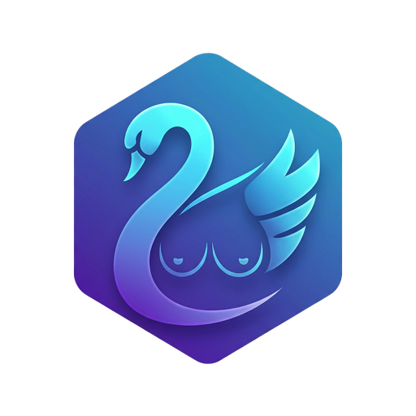

# BoobsOS

Desktopowy Linux dla DevOps, programistów i inżynierów IT — oparty na Fedorze Atomic (bootc/OCI).
Środowisko gotowe do pracy od razu po instalacji: kontenery, Kubernetes, narzędzia chmurowe, edytory.

## Jak to działa

System dostarczany jest jako **wersjonowany obraz OCI** (nie klasyczny ISO z pakietami).
Aktualizacje są atomowe (`bootc upgrade`), rollback jedną komendą (`bootc rollback`).
Szczegóły architektury: [ARCHITECTURE.md](ARCHITECTURE.md) | Branding: [branding/BRANDING.md](branding/BRANDING.md).

---

## Budowanie lokalnie

Wymaga: `podman` zainstalowanego lokalnie (Fedora, RHEL, Ubuntu z podmanem).

```bash
./build.sh
```

Zbudowany obraz dostępny jako `boobsos:dev`:

```bash
podman run --rm -it boobsos:dev bash
```

---

## Generowanie ISO

Do generowania ISO z obrazu OCI służy `bootc-image-builder`.
Wymaga root / podman z `--privileged`.

```bash
# Najpierw wypchnij obraz do rejestru lub zbuduj lokalnie przez ./build.sh
sudo podman run \
    --rm \
    --privileged \
    --pull=newer \
    --security-opt label=type:unconfined_t \
    -v $(pwd)/output:/output \
    -v /var/lib/containers/storage:/var/lib/containers/storage \
    ghcr.io/osbuild/bootc-image-builder:latest \
    --type iso \
    --local \
    localhost/boobsos:dev

# Wynik: output/bootiso/install.iso
```

---

## Rebase z istniejącej Fedory Atomic

Jeśli masz zainstalowaną Fedorę Silverblue / Fedorę Atomic, możesz przejść na BoobsOS jedną komendą:

```bash
sudo bootc switch ghcr.io/<org>/boobsos:latest
```

Po restarcie system uruchomi się jako BoobsOS. Rollback: `sudo bootc rollback`.

---

## Wygląd pulpitu — tradycyjny układ (nie macowy)

BoobsOS konfiguruje GNOME jako tradycyjny desktop w stylu Windows — nie domyślny układ GNOME (pływający dock + górny pasek + activities overview).

**Co jest zmienione względem domyślnego GNOME:**

| Element | Domyślny GNOME | BoobsOS |
|---------|---------------|---------|
| Pasek zadań | Pływający dock (dół) + górny pasek | **Dash to Panel** — jeden pasek na dole z listą okien |
| Ikony zasobnika | Brak (GNOME usuwa tray) | **AppIndicator** — pełne ikony tray (Bluetooth, VPN, itp.) |
| Przyciski okien | Tylko zamknij | **Minimalizuj + Maksymalizuj + Zamknij** |
| Motyw | Jasny (Adwaita) | **Ciemny** (Adwaita-dark) |
| Akcent | Brak / niebieski | **Niebieski (#2563EB)** |
| Tapeta | Domyślna Fedory | **Gradient marki BoobsOS** |

Rozszerzenia zainstalowane z pakietów Fedory 44 (rpm, nie extensions.gnome.org):
- `gnome-shell-extension-dash-to-panel` (UUID: `dash-to-panel@jderose9.github.com`)
- `gnome-shell-extension-appindicator` (UUID: `appindicatorsupport@rgcjonas.gmail.com`)

Menu Start (Arc Menu) nie jest dostępne w Fedora 44 jako pakiet rpm — użytkownik może doinstalować przez GNOME Extension Manager (`flatpak install flathub com.mattjakeman.ExtensionManager`).

**Pasek zadań (favorite-apps):** `brave-browser` | `code` | `org.gnome.Nautilus` | `org.gnome.Ptyxis` | `org.gnome.Settings`

**Katalog Desktop:** widoczny w Nautilusie (panelu bocznym) dzięki `XDG_DESKTOP_DIR` w `/etc/skel/.config/user-dirs.dirs`. Katalog `~/Desktop` tworzony automatycznie dla nowych użytkowników.

**Hostname systemu:** `boobsos` (plik `/etc/hostname` w overlay).

---

## CI/CD

Pipeline GitLab (`.gitlab-ci.yml`) buduje obraz przy każdym push i publikuje go
do GitLab Container Registry przy push na gałąź `main`.

---

## Co jest z pudełka

Środowisko gotowe do pracy od razu po instalacji — bez konfiguracji po instalacji:

| Kategoria | Narzędzia |
|-----------|-----------|
| Kontenery | Docker CE, Podman, Buildah, Skopeo, Distrobox, docker-compose |
| Kubernetes | kubectl, helm, k9s, kubectx/kubens, kustomize, stern, kind |
| IaC | Terraform, OpenTofu, Ansible |
| Chmura | AWS CLI v2, azure-cli (az), google-cloud-cli (gcloud) |
| Sekrety | Vault (HashiCorp), SOPS, age (+ YubiKey plugin), GnuPG, pass |
| Git i hosting | git, git-lfs, gh (GitHub CLI), glab (GitLab CLI), lazygit |
| Shell | zsh, tmux, starship (prompt), fastfetch |
| CLI UX | neovim, fzf, ripgrep, bat, eza, fd, zoxide, jq, yq, git-delta, direnv, htop, btop, ncdu, tree |
| Dotfiles | Neovim (LSP/treesitter/telescope — lazy.nvim, mason), oh-my-zsh (theme ys, autosuggestions, syntax-highlighting) — domyślne dla nowych użytkowników (via /etc/skel) |
| Build/języki | gcc/make (@development-tools), Go, Python 3, mise (node/ruby/etc.) |
| Sieć | nmap, tcpdump, mtr, wireshark-cli (tshark), httpie, wireguard-tools, iperf3, socat, hping3 |
| Bezp. / audyt | hashcat (GPU password recovery), hping3, auditd, firewalld, logrotate |
| Przeglądarki | Brave Browser (przypięty na pasku), Google Chrome (zainstalowany), Firefox (zainstalowany — odpięty z paska) |
| Aplikacje | VS Code (rpm), Tor Browser Launcher (rpm), OnlyOffice Desktop Editors (flatpak, 1. boot), openconnect VPN |
| Bezpieczeństwo | firewalld (strefa FedoraWorkstation), auditd, logrotate |
| Flatpak/GUI | Flathub włączony; OnlyOffice instalowany automatycznie przy 1. boocie; dopisz Spotify/Slack w skrypcie `boobsos-install-flatpaks` |

---

## Edycje

BoobsOS dostępny w dwóch niezależnych wariantach.

| Edycja | Obraz | Baza | Opis |
|--------|-------|------|------|
| **Bazowa** | `ghcr.io/filip-zienowicz/boobsos:latest` | ublue silverblue-main | Stack DevOps: Docker, K8s, VS Code, Brave, branding |
| **Game** | `ghcr.io/filip-zienowicz/boobsos-game:latest` | ublue silverblue-nvidia | Czysto gamingowa: Steam, Lutris, Heroic, MangoHud, Gamescope, Brave, Discord, OBS — **BEZ DevOps**, **sterowniki NVIDIA** |

Edycja Game jest **niezależna** od bazowej — nie dziedziczy stacku DevOps, bazuje bezpośrednio
na `ghcr.io/ublue-os/silverblue-nvidia:latest` (preinstalowane sterowniki NVIDIA + mesa AMD/Intel).

### Instalacja edycji Game

```bash
sudo bootc switch ghcr.io/filip-zienowicz/boobsos-game:latest
```

Po restarcie usługa `boobsos-firstboot-flatpaks` zainstaluje Steam, Lutris, Heroic, ProtonUp-Qt, Discord i OBS Studio.
Szczegóły: [editions/game/README.md](editions/game/README.md).

---

## Roadmap

| Faza | Opis | Status |
|------|------|--------|
| F0 | Branding (logo, paleta) | ✅ |
| F1 | Szkielet repo + minimalny Containerfile | ✅ |
| F2 | Pakiety DevOps + Flathub | ✅ |
| F3 | Branding w systemie (Plymouth, GDM, tapeta, tradycyjny desktop) | ✅ |
| F4 | Przeglądarki (Chrome+Brave), hping3+hashcat, hostname, Desktop w Nautilusie, favorite-apps | ✅ |
| F5 | CI + publikacja obrazu do rejestru | ⬜ |
| F6 | Generowanie ISO, test w VM | ⬜ |
| F7 | Dokumentacja użytkownika | ⬜ |
